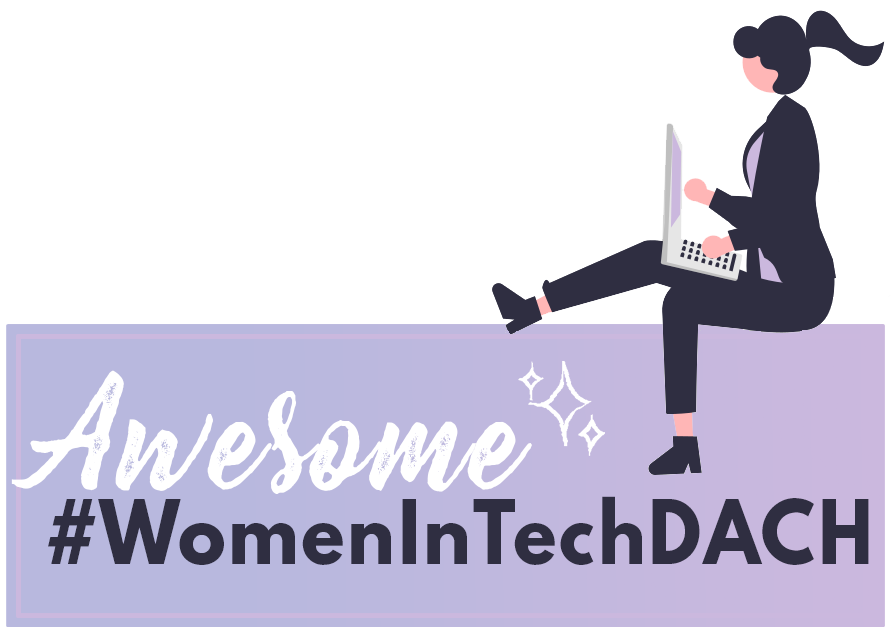

# Awesome Woman in Tech DACH 

A curated list focussing of awesome and inspiring women in tech/IT, meetups and initiatives in German speaking regions - German, Austria, Switzerland (DACH).

Translations: [GER :de:](README.md) | [ENG :gb:](README.en.md)

## Scope
"Tech" bzw. IT spielt in vielen Bereichen des Lebens eine Rolle - und ebenso viele tolle Frauen arbeiten und wirken in diesen. Diese Liste sammelt Frauen, Meetups und Initiativen, die sich vor allem mit dem **Bereich IT** befassen.

## Awesome Women to follow
Du findest hier vor allem Verlinkung zu Twitter, Instagram oder Blogs.  
Weitere tolle Frauen aus der IT und dem Tech-Bereich findest du in den nächsten Tagen in der `#WomenInTechDACH Twitter Liste (work in progress)` oder zukünftig in weiteren Sub-Listen in diesem Repos.

### Deutschland
* Anaïs Urlichs | [Twitter](https://twitter.com/urlichsanais)
* Anika Zohren | [Twitter](https://twitter.com/StayStrange42)
* Antje Lamartine | [Twitter](https://twitter.com/AntjeLamartine)
* Bianca Kastl | [Twitter](https://twitter.com/bkastl)
* Carola Lilienthal| [Twitter](https://twitter.com/Cairolali)
* Daniella Domokos | [Twitter](https://twitter.com/Akoneira) | [Blog](https://www.allaboutlegaltech.de/)
* Feli | [Twitter](https://twitter.com/kotzendekrabbe)
* Jutta Eckstein | [Twitter](https://twitter.com/JuttaEckstein) | [Blog](https://www.allaboutlegaltech.de/)
* Katrin Rabow | [Twitter](https://twitter.com/KatrinRabow)
* Kathring Radtke | [Twitter](https://twitter.com/RadtkeKathrin)
* Kenza Ait Si abbou | [Twitter](https://twitter.com/KenzaAbbou)
* Laura Sophie Dornheim | [Twitter](https://twitter.com/schwarzblond)
* Luise Freese | [Twitter](https://twitter.com/LuiseFreese)
* Marianne Spiller | [Twitter](https://twitter.com/netzwerkgoettin)
* Magdalena Rogl | [Twitter](https://twitter.com/LenaRogl)
* Maren Heltsche | [Twitter](https://twitter.com/zaziemo)
* manu | [Twitter](https://twitter.com/codePrincess)
* Nora Schöner | [Twitter](https://twitter.com/wolkencode) | [Instagram](https://www.instagram.com/wolkencode/) | [Blog](https://wolkencode.de)
* Nicola Marsden | [Twitter](https://twitter.com/Nicola_Marsden)
* Pia Diedam | [Twitter](https://twitter.com/piadiedam)
* Rania | [Twitter](https://twitter.com/TechRania)
* Ramona Schwering | [Twitter](https://twitter.com/leichteckig)
* Sandra Ahlgrimm | [Twitter](https://twitter.com/sKriemhild) | [Instagram](https://www.instagram.com/cashycodes/) | [Blog](https://ahlgrimm.dev/blog-2/)
* Sandra Gerberding | [Twitter](https://twitter.com/stgerberding)
* Sandra Parsick | [Twitter](https://twitter.com/SandraParsick) | [Blog](https://blog.sandra-parsick.de/)
* Sophia Cook | [Twitter](https://twitter.com/Soisco)
* Susanne Braun | [Twitter](https://twitter.com/susannebraun)
* Tatjana Moser | [Twitter](https://twitter.com/frau_mpkt) | [Blog](https://twitter.com/codePrincess)

### Österreich
* Doris Schlaffer | [Twitter](https://twitter.com/dorischlaffer)
* Linda Mohamed | [Twitter](https://twitter.com/linda_mhmd)

### Schweiz
* Ixchel Ruiz | [Twitter](https://twitter.com/ixchelruiz)

## Meetups & regelmäßige Events
> Legende: :computer: - remote Events möglich

### Deutschland
* [Geekfem](https://twitter.com/geekfem_)
* [FemDevMeetup](https://femdevsmeetup.com/) | divers | :computer:
* [She 'n IT Nürnberg](https://www.meetup.com/de-DE/she-n-it-nuremberg/) | Nürnberg, BY | :computer:
* [Women Techmakers Nuremberg](https://www.meetup.com/de-DE/Women-Techmakers-Nuremberg/) | Nürnberg, BY | :computer:

### Österreich
* [#thenewITgirls Meetup](https://www.meetup.com/de-DE/thenewITgirls/events/) | Wien, W | :computer:

### Schweiz
* 

## Initiativen
### Deutschland
* [Coffee Code Break (Mentoring)](https://coffeecodebreak.de/)
* [haecksen.org](https://www.haecksen.org/)
* [FrauenLoop](https://www.frauenloop.org/)
* [GIRLS Hacker School](https://hacker-school.de/formate/girls-hacker-school/)
* [ITgirls](https://itgirls.de/)
* [MoinWorld e.V.](https://moinworld.de/)
* [#SheTransformsIT](https://www.shetransformsit.org/)
* [Speakerinnen.org](https://speakerinnen.org/)
* [Women In Tech // Deutschland // Österreich // Schweiz](https://www.womenintechev.de/)

### Österreich
* [#thenewITgirls](https://www.thenewitgirls.com/)
* [Women in AI Austria](https://www.womeninai.at/)

### Schweiz
* 

## Podcasts
> :bulb: soon to come

## Mitmachen/Contribution
Du findest dich oder andere tolle Frauen, Meetups, Initiativen und Podcasts nicht in dieser Liste? 
[Mach mit und erweitere die Liste! Achte bitte auf die Contribute Guidelines!](CONTRIBUTE.md)

Du hast einen Fehler gefunden? Bitte erstelle einen Pull Request mit deiner vorgeschlagenen Änderung.

Du möchtest dieses Projekt regelmäßig unterstützen? Dann schreib nora@wolkencode.de eine E-Mail mit der Idee, wie du dieses Projekt unterstützen willst. Noch keine Idee, aber Lust zu helfen? Auch kein Problem. Meld dich einfach bei mir.

# License

 This work is licensed under a <a rel="license" href="http://creativecommons.org/licenses/by/4.0/">Creative Commons Attribution 4.0 International License</a>.

Please provide a link back to this repository. This is not necessary for GitHub forks.

 

---

Initiated with :heart: by [Nora Schöner](https://github.com/norchen).

